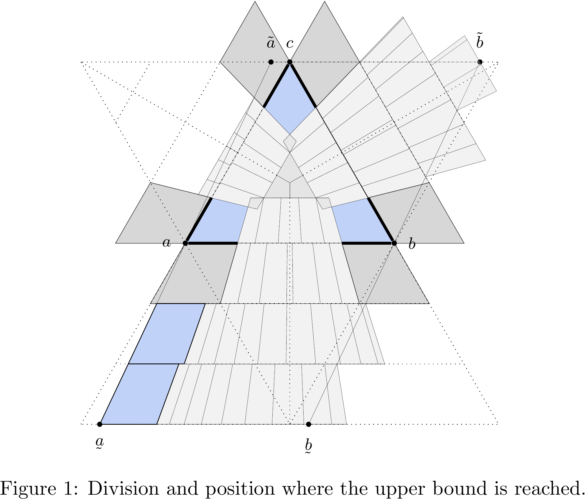

# Partial Drawings of Complete Graphs

**An estimate for the upper bound on the number of basis points of a partial edge drawing of a complete graph**

<p align="center">
<figure class="image">
  
</figure>
</p>

## Introduction
This repository contains the source code for my Bachelor thesis on the topic of: "Partial Edge Drawings of Complete Graphs". In `scripts` are the main modules in Mathematica in which we programmed the calculation of the upper bound on the number of points of partial edge drawing. The division of the plane and position of edge points where the calculated upper bound is reached is shown in Figure 1.

You can find the thesis report [here](https://zenodo.org/record/4079466/files/PartialDrawings_BScThesis_2014.pdf?download=1) or check the [presentation slides](https://zenodo.org/record/4079483/files/PartialDrawings_SeminarSlides_2014.pdf?download=1) for a quick overview.

## Abstract
Partial edge drawing of a graph is a rectilinear drawing in which a middle portion of an edge is removed from the drawing. In addition, we require that the drawing is without edge crossings. Currently, the best estimate claims that there is no partial edge drawing of the complete graph on 241 or more points. In this work, we improve the estimate by a factor of more than two. We show that it is not possible to draw a partial edge drawing of the complete graph on 102 or more points. The main ideas are two. On the one hand, we use a different division of the plane on which the points of the graph are located. Instead of the coordinate division of the plane, we use the areas along the rays from pre-selected points of the drawing. On the other hand, we analyze the whole drawing of the graph by the location of three, sometimes even four, points of the drawing and not only two points as in the previous estimates.

**Keywords:** partial edge drawings, graph theory, planar graphs, analytic geometry.

## Citing
If you find this work useful in your research, please consider citing using the Zenodo record::
```
@misc{lalovic_marko_2014_4079466,
  author       = {Lalović, Marko},
  title        = {Partial Drawings of Complete Graphs},
  month        = sep,
  year         = 2014,
  note         = {70 pages},
  publisher    = {Zenodo},
  doi          = {10.5281/zenodo.4079466},
  url          = {https://doi.org/10.5281/zenodo.4079466}
}
```
